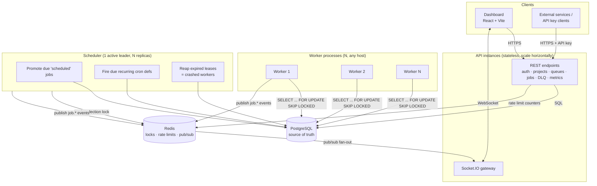

# Architecture

## System diagram



## Why three separate processes

**API server.** Stateless, horizontally scalable, holds no in-memory job state. Its only
job is validated CRUD + auth + serving the WebSocket gateway. Because it's stateless,
you can run any number of instances behind a load balancer without coordination — the
only shared state is Postgres and Redis.

**Worker.** Deliberately a separate process (or fleet of processes/containers) from the
API server. Job execution is CPU/IO-bound and can run long; coupling it to the request/
response cycle of an HTTP server would mean a slow job holds an API thread hostage, and
scaling workers would force you to scale API capacity in lockstep even if API traffic is
flat. Workers talk directly to Postgres (not through the REST API) using the same
service-layer functions the API imports — this avoids an unnecessary HTTP hop on the
hot polling path and avoids duplicating claim/execute logic in two places.

**Scheduler.** Anything that must happen *exactly once cluster-wide on a timer* — promoting
due jobs, firing cron definitions, reaping crashed workers — is isolated here rather than
duplicated across every worker (which would cause N-times-duplicated promotion/cron-firing
if done naively). It's still safe to run multiple scheduler replicas for availability: a
Redis lock elects one leader per tick, and losing leadership just pauses promotion
momentarily until another replica picks it up — it never causes a job to run twice,
because that guarantee lives independently at the database layer (see below).

## Where the reliability guarantee actually lives

The single most important design decision in this system: **atomic claiming is a database
guarantee, not an application-level guarantee.** Every "claim" is:

```sql
WITH candidate AS (
  SELECT id FROM jobs
  WHERE queue_id = $1 AND status = 'queued' AND run_at <= now()
  ORDER BY priority DESC, run_at ASC
  LIMIT (SELECT n FROM available)   -- respects max_concurrency and pause state
  FOR UPDATE SKIP LOCKED
)
UPDATE jobs SET status = 'claimed', claimed_by = $3, ...
FROM candidate WHERE jobs.id = candidate.id
RETURNING jobs.*;
```

`FOR UPDATE SKIP LOCKED` means: when two workers run this simultaneously, Postgres lets
each one lock a disjoint set of rows and skips whatever the other has already locked,
rather than blocking or double-assigning. This holds regardless of how many worker
processes exist, on how many machines, written in any language — it's a property of the
database, not of any coordination code we wrote. This is proven directly in
`backend/tests/concurrency.test.ts` with 25 concurrent claimants against 200 jobs.

Everything else in the architecture (Redis locks, leader election, event pub/sub) is
there for *liveness and observability*, not *correctness* — if Redis is unavailable,
worst case is scheduler promotion pauses and the dashboard stops getting live pushes
(it falls back to polling). Job execution correctness never depends on Redis being up.

## Failure handling at each layer

| Failure | Detection | Recovery |
|---|---|---|
| Worker process crashes mid-job | `locked_until` lease expires without a heartbeat renewal | Scheduler's reaper routes the job through the normal retry/DLQ logic, as if it were any other failure |
| Worker loses DB connectivity | Query errors surface to the poll loop | Poll loop logs and retries on the next tick; in-flight jobs' leases expire and get reaped |
| Scheduler replica crashes | Redis lock TTL expires | Another replica acquires the lock on its next tick attempt |
| API instance crashes | Load balancer health check | Stateless — traffic reroutes to remaining instances, no job state lost (nothing lived in that process) |
| Redis unavailable | Connection errors, logged | Rate limiting fails open is avoided (checked explicitly); live WS updates stop; scheduler ticks skip (self-healing on reconnect); **job execution is unaffected** |
| Worker shuts down gracefully (SIGTERM) | N/A — cooperative | Stops polling immediately, waits up to `WORKER_SHUTDOWN_GRACE_MS` for in-flight jobs to finish, then marks itself offline; anything still running is left for the lease reaper rather than force-killed mid-execution |

## Scaling story

- **More job throughput** → add worker processes. They coordinate purely through Postgres
  row locks; no additional configuration needed.
- **More API traffic** → add API instances behind a load balancer; stateless.
- **More queues/tenants** → the schema is already multi-tenant (organizations → projects →
  queues), so this requires no architectural change, only data growth.
- **Very high job-table write volume** → the natural next step (not implemented here, see
  `DESIGN_DECISIONS.md`) is partitioning the `jobs` table by `queue_id` hash or by
  `created_at` range, since Postgres partitioning is transparent to the claim query as
  long as each partition keeps its own `idx_jobs_claim` index.
